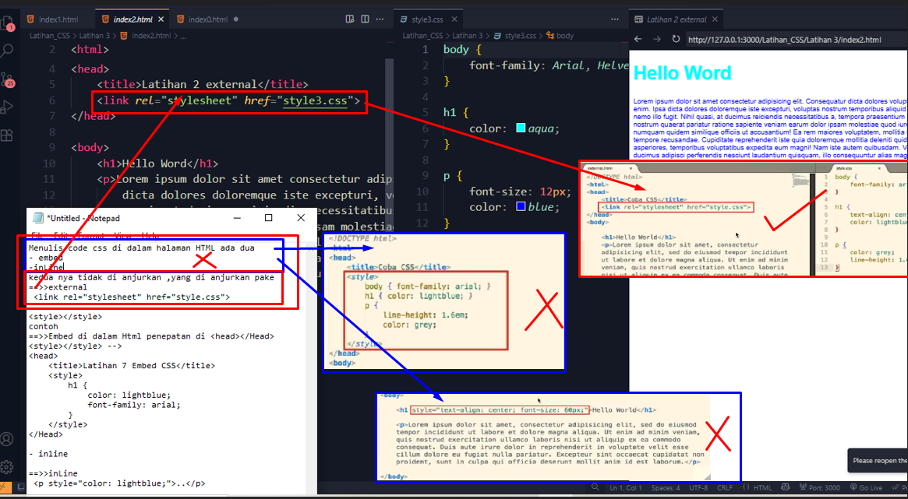
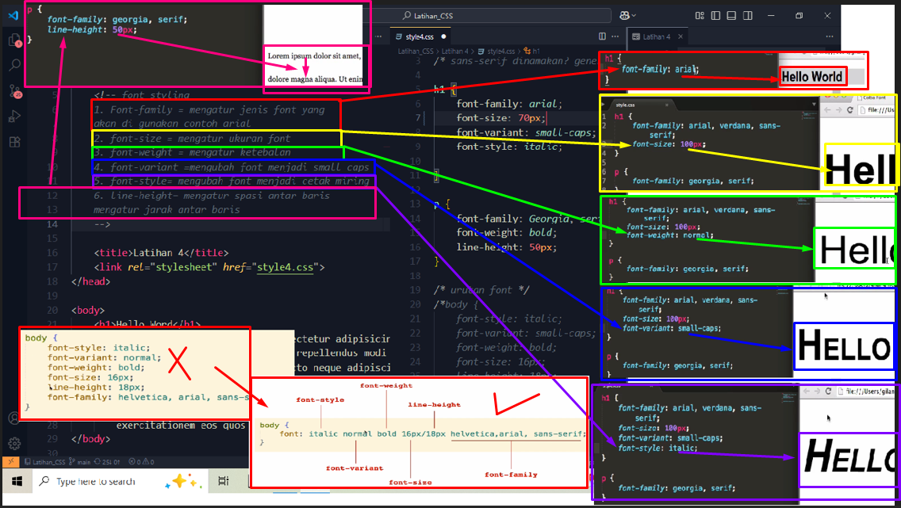
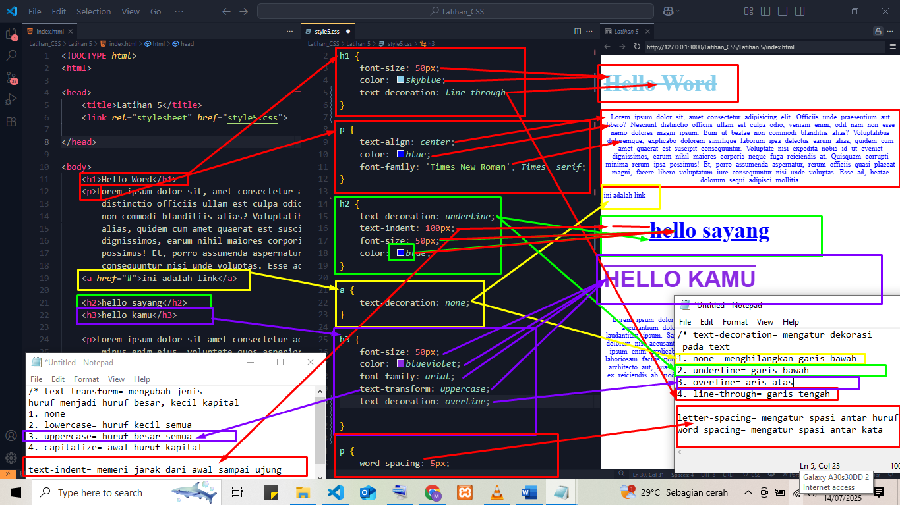
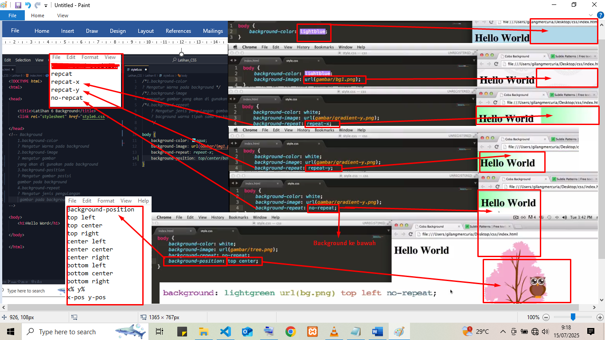
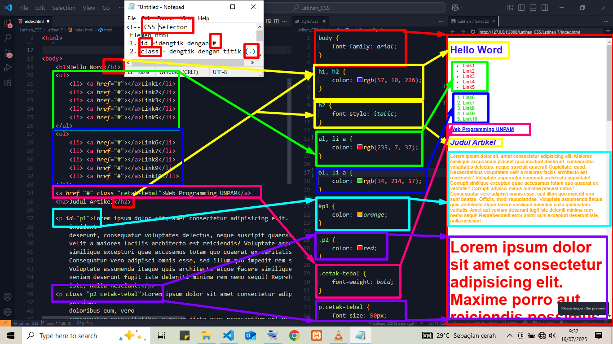
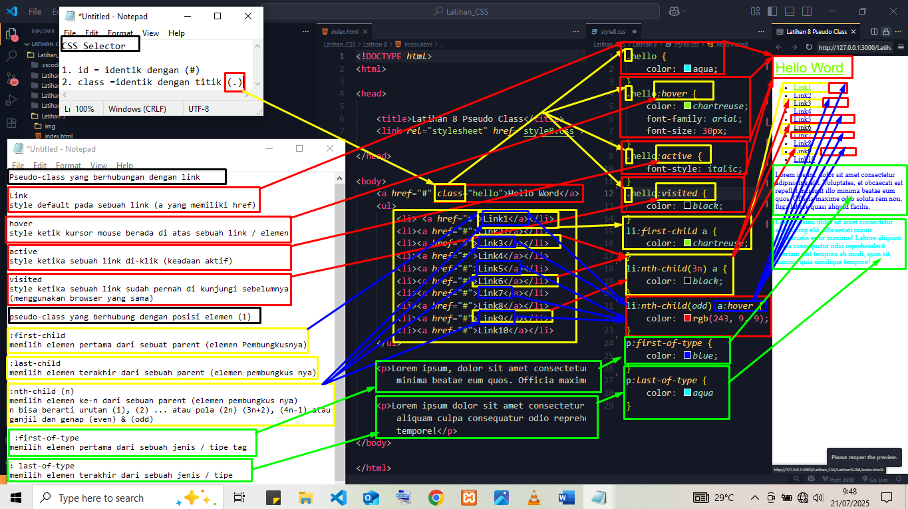
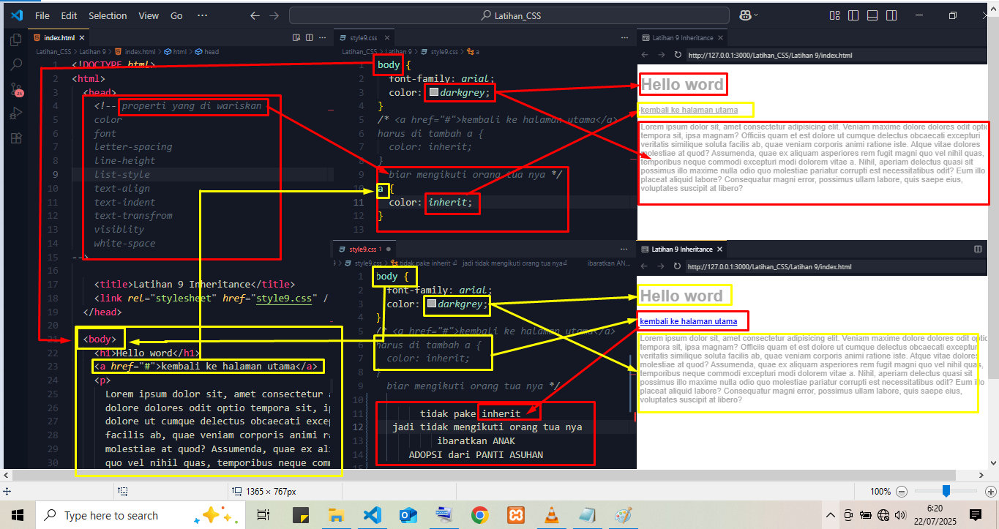
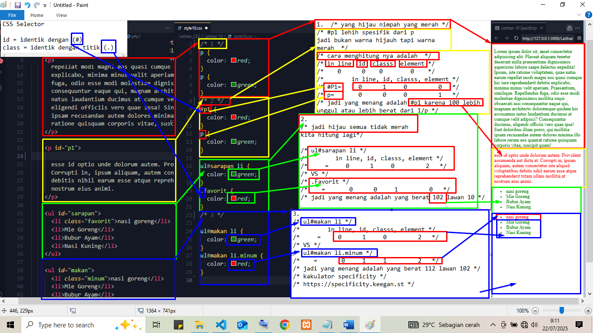

## CSS 

## 1. Latihan 1 Pendahuluan

## 2. Latihan 2  Anatomi CSS

## 3. Latihan 3 Penempatan CSS

## 4. Latihan 4 Font Styling

## 5. Latihan 5 Text Styling

## 6. Latihan 6 Background

## 7. Latihan 7 Selector

## 8. Latihan 8 Pseudo Class

## 9. Latihan 9 Inheritance

## 10. Latihan 10 Specificity

